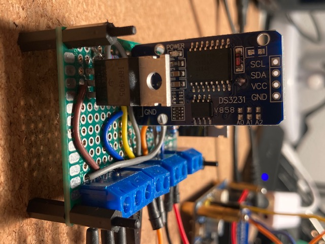
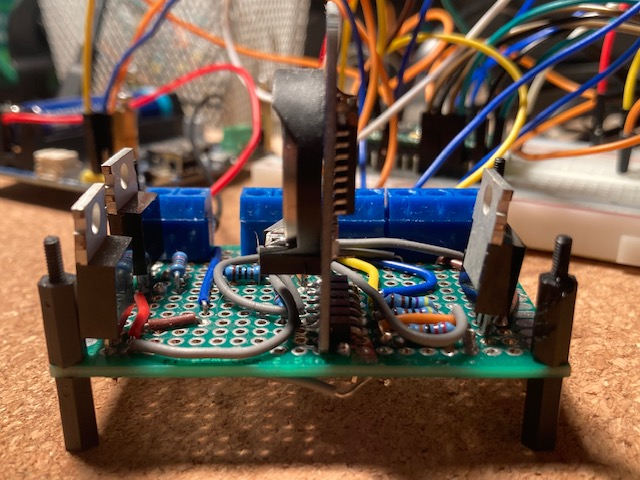
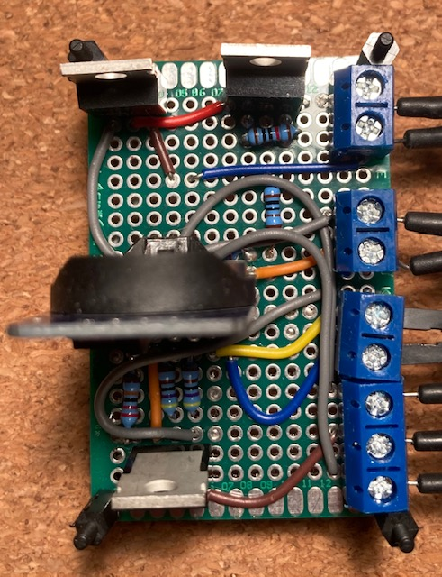
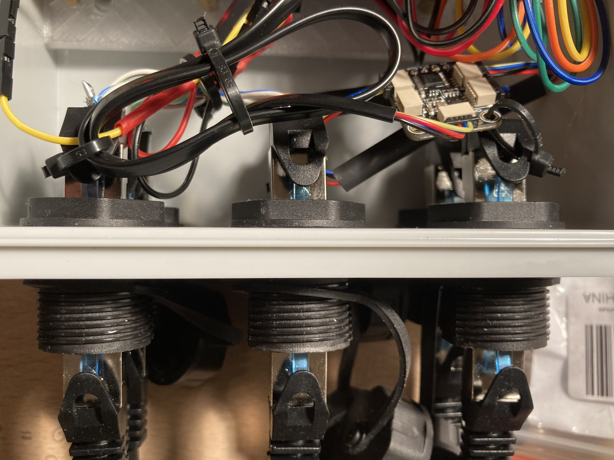
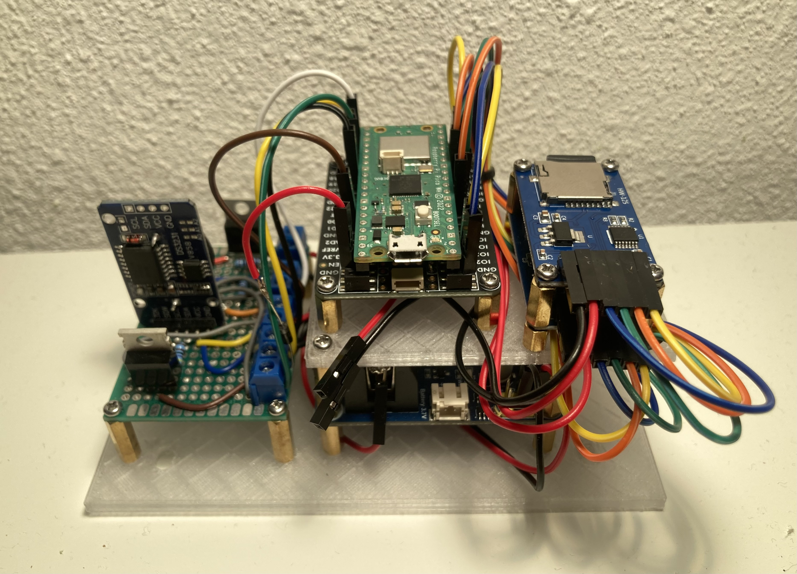
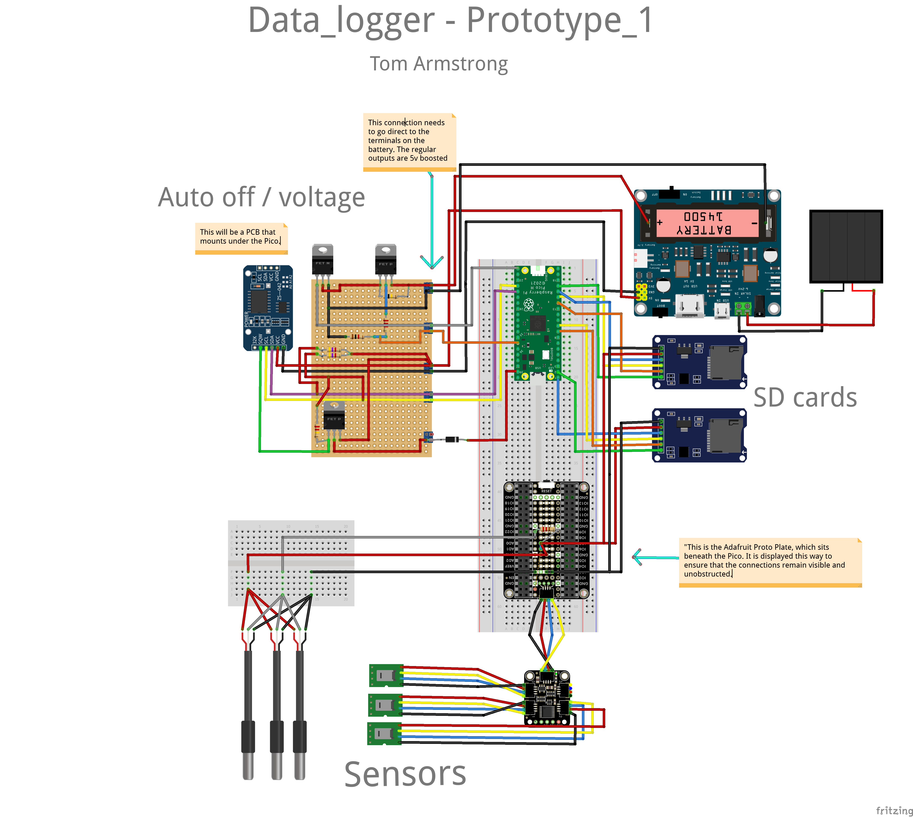
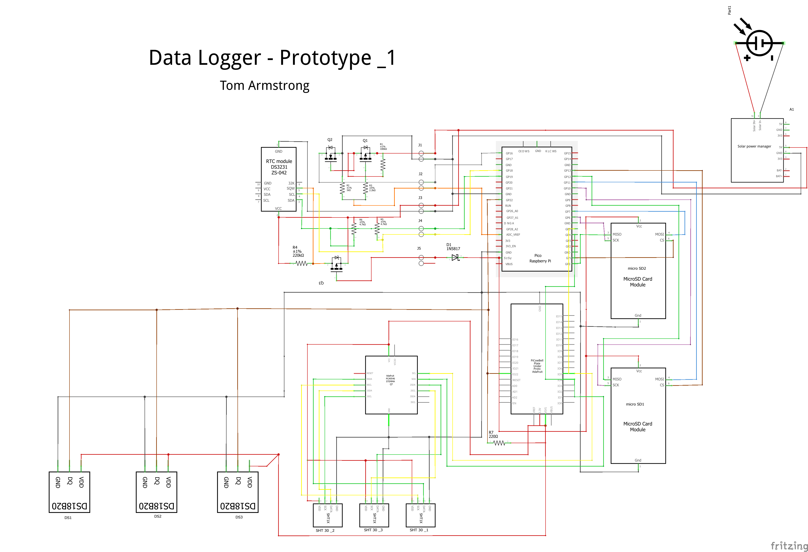
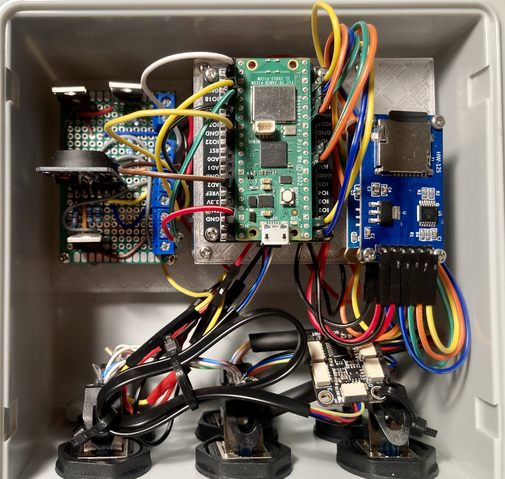

# Build Overview

----

This Pico-based Data Logger is a low-power, autonomous environmental monitoring system. It features a Raspberry Pi Pico WH alongside multiple sensors, power management circuits, and data storage components to ensure efficient and reliable data collection. Below is a comprehensive breakdown of the hardware components, followed by step-by-step assembly instructions.

## Hardware Components

### 1. Core Processing Unit
- **Raspberry Pi Pico WH** – Handles data acquisition, processing, and storage.

### 2. Sensors
- **Temperature Sensors:**
  - 3 × DS18B20 (1-Wire protocol) for temperature measurements.
- **Temperature & Humidity Sensors:**
  - 3 × SHT30 (I2C protocol) for dual temperature and humidity readings.

### 3. Data Storage
- 2 × SD Card Breakout Boards – Connected via SPI for data storage.

### 4. Power Management
- **Waveshare Solar Power Manager Module** – Manages solar charging and battery output.
- **14500 LiPo Battery** – Provides backup power for continuous operation.
- **DS3231 Real-Time Clock (RTC)** – Controls power cycles to optimize energy consumption.

### 5. Transistors and Resistors
- **MOSFETs:**
  - P-Channel: 2 × IRF4905
  - N-Channel: 1 × IRFZ44N
- **Resistors:**
  - 2 × 4.7KΩ
  - 1 × 220KΩ
  - 1 × 1KΩ
  - 1 × 2.2KΩ
  - 1 × 100KΩ

### 6. Additional Components
- **PCA9546A I2C Multiplexer** – Expands the I2C bus for multiple sensors.
- **Adafruit Proto Underplate** – A prototyping board for mounting and connecting components.
- **Jumper Wires** – For flexible connections.
- **Perf-board** – 6 × 4 cm prototyping board.
- **Waterproof Housing** – [Amazon Link](https://www.amazon.de/-/en/dp/B0D4V6SBXM?ref=ppx_yo2ov_dt_b_fed_asin_title)
- **RJ45 Patch Cables** – [Amazon Link](https://www.amazon.de/-/en/dp/B0797SCT55?ref=ppx_yo2ov_dt_b_fed_asin_title)
- **RJ45 Waterproof Couplings** – [Amazon Link](https://www.amazon.de/-/en/dp/B0CRZ3MTG8?ref=ppx_yo2ov_dt_b_fed_asin_title)


 


## **Step-by-Step Assembly**

### **1. Setting Up the Raspberry Pi Pico WH**

The Raspberry Pi Pico WH comes pre-soldered with headers, making it easier to connect components. However, if you are using a standard **Raspberry Pi Pico** (without pre-soldered headers), you will need to solder them manually before proceeding.

### **Soldering the Headers (If Necessary)**
If you are using a **Raspberry Pi Pico (non-WH version)** without pre-soldered headers, follow these steps:

#### **Required Materials:**
- **40-pin male headers** (included with most Pico kits)
- **Soldering iron** (set to ~350°C or a fixed-temperature iron over 40W)
- **Solder**
- **Breadboard** (optional but recommended)

#### **Steps:**
1. Insert the **male headers** into a breadboard to hold them steady.
2. Place the **Pico board** onto the headers with the component side facing up.
3. Heat one **corner pin** with the soldering iron and apply **a small amount of solder** to hold the header in place.
4. Repeat for the opposite corner to keep the board level.
5. Solder the remaining pins, ensuring a clean, shiny connection without excess solder.
6. Inspect the joints and remove any solder bridges if necessary.

### **Flashing MicroPython onto the Pico WH using Thonny**

Before the Pico WH can run your data logging program, you must install **MicroPython**—a lightweight Python implementation designed for microcontrollers. Follow these steps to flash MicroPython onto your Pico WH using **Thonny IDE**:

#### **Step 1: Download and Install Thonny**
1. Visit [Thonny’s official website](https://thonny.org/) and download the version suitable for your operating system.
2. Install Thonny by following the on-screen instructions.

#### **Step 2: Connect the Pico WH in Bootloader Mode**
1. **Hold down the BOOTSEL button** on the Pico WH.
2. While holding the button, **connect the Pico WH to your computer** using a micro-USB cable.
3. Release the **BOOTSEL button** once the device appears as a new storage drive named **RPI-RP2** on your computer.

#### **Step 3: Download and Install MicroPython**
1. Open **Thonny IDE**.
2. Click on **"Run" → "Select Interpreter"** from the menu.
3. In the dialog box, choose:
   - **Interpreter**: MicroPython (Raspberry Pi Pico)
   - **Port**: Select the COM port where the Pico is connected
4. If MicroPython is not already installed, Thonny will prompt you to **install MicroPython firmware**.
5. Click **"Install"** and wait for the process to complete.

#### **Step 4: Verify MicroPython Installation**
1. After installation, a **Python shell (REPL)** will appear at the bottom of Thonny.
2. Type:
   ```python
   print("Hello, Pico!")
   ```  
   and press **Enter**. If the message prints successfully, MicroPython is installed correctly.

---


### **2. Modifications to the DS3231**

Articles I have read, including this [blog](https://thecavepearlproject.org/2014/05/21/using-a-cheap-3-ds3231-rtc-at24c32-eeprom-from-ebay/), highlight the need for modifications to the DS3231 to ensure proper functionality when using its alarm as a trigger for the P-channel MOSFET.  

The DS3231 includes pull-up resistors on the SQW (alarm) line, which must be removed. However, these resistors are part of a resistor block that also contains the necessary I2C lines (SCL, SDA). To compensate for their removal, external 4.7KΩ pull-up resistors must be reintroduced into the circuit to maintain proper operation. This modification provides greater control over the pull-up resistance for the SQW (alarm) line, ensuring reliable triggering.

The other necessary modification is the removal of the charging circuit for the coin battery. The same [blog](https://thecavepearlproject.org/2014/05/21/using-a-cheap-3-ds3231-rtc-at24c32-eeprom-from-ebay/) mentioned earlier, along with other sources, recommends disabling this feature for safety reasons.  

To achieve this, the charging resistor can be removed.  

The image below highlights both resistors that should be removed. Applying heat and gentle pressure will quickly dislodge them. However, be careful not to apply excessive force, as this could damage the DS3231 or cause injury.


### **3. Making the auto-power off and voltage indicator circuits**

The auto power-off and voltage measurement circuit was built on a 6 × 4 cm section of double-sided perfboard. Before transitioning to the more permanent perfboard, the circuit was first assembled and tested on a breadboard.

All soldering was done on the underside at a temperature of 350 °C. The resistors used in the voltage divider were 1 kΩ and 2.2 kΩ. External pull-ups for the RTC were 4.7 kΩ, while the pull-ups for the transistor in the voltage divider were 100 kΩ, and for the auto power-off, 220 kΩ.

The voltage divider was powered directly from the battery, with leads soldered to the positive and negative terminals. This approach was necessary because the main output of the Waveshare power unit is boosted to 5V.

Below are some images to assist in its reconstruction. I plan to make this into a PCB hat for the pico in the future.






### **4. Preparing the water-proof housing**

I decided to use **RJ45 couplers** ([link](https://www.amazon.de/dp/B0CRZ3MTG8?ref=ppx_yo2ov_dt_b_fed_asin_title&th=1)) to connect the sensors through the waterproof case. This choice was mainly driven by cost. While there are likely more robust and better-form-factor waterproof through couplers available, these were much more affordable at the time.

I drilled **23mm holes** using a **Forstner drill bit** ([link](https://www.amazon.de/-/en/dp/B0BQ7CHXVP?ref=ppx_yo2ov_dt_b_fed_asin_title)) through the bottom of the case. Care must be taken when measuring the holes, as there is little tolerance. I ensured that the long side of the coupler was oriented on the outside of the box to provide more space for cabling later on.

A waterproof gland also needs to be added to the right side of the case for the solar input. I installed this after mounting the hardware and positioning it inside the case to ensure proper placement. I used a [PG7 Waterproof Gland](https://www.amazon.de/-/en/PUWOWYE-PG13-5-Connection-Waterproof-Feed-Through/dp/B0D838PL5S/ref=sr_1_5?crid=3VYAEA9W50VLR&dib=eyJ2IjoiMSJ9.Q9CmCOnGXfRoucIfuKd7BdRH0-l3h82cQp6yr2v_Vg9pRBa01lQ0Fz92AT5TaWTsEU0SzQaOfyxX7jVMbH3LLwQEF5aS7L19sCNyssScw_GWa2gCnlKFqg3L8Pp5gVR1VP89EGvzKkPAELC581C-Ai2ol1jDAtyImadjeD5mljd2Flqo94XmRd5nsJ0CdMYMnLurS91rKUhFBPPV8BsYveNp-JJagVgK5SDnhs8dxwmdUFIGr-s83yt4Q3C5t1vAvaFS7bLOCZiyjt6ZNqI0ZDUUQvZMy9nZbHwMDojIzKwLJYu5AE41qlHVQQF4nqyugdC7wWea3owpc50YH6Ds89u9Lj5AAUjzP7BJqfbJx4I.5qhio0pf8YrQWuRzZwF3qk-BzBsrOmGI9dKGIbOaoys&dib_tag=se&keywords=water+proof+gland+pg7&qid=1741373254&s=industrial&sprefix=water+proof+gland+pg7%2Cindustrial%2C141&sr=1-5) for this purpose.


### **5. Preparing the Sensors**  

Using RJ45 couplers required modifying the ends of each sensor to allow them to connect properly. To achieve this, I purchased some short [Cat7 patch cables](https://www.amazon.de/dp/B0797SCT55?ref=ppx_yo2ov_dt_b_fed_asin_title&th=1). I cut a 10 cm length, removed the shielding to expose the four wire pairs, then stripped and twisted the pairs together.  

For the temperature sensors, which have three wires, one pair could be discarded. The connector and the sensor wire were then soldered together and insulated. The humidity/temperature sensors, however, use a digital protocol that requires four wires, meaning all pairs from the Cat7 cable are needed.  

**Be sure to note where each wire is connected to the RJ45 plug, as you'll need to replicate this inside the box and route each wire correctly to the Pico.**

I chose to merge the three wires from each temperature sensor inside the case before routing them to the Pico. Since they use the digital "1-wire" protocol, this connection needed to be made somewhere, and doing it inside the case kept the wiring clean.  

This involved soldering all power wires together, all ground wires together, and all signal wires together using three pairs from another set of RJ45 connectors. Three wires (Power, Ground, and Signal) then emerged from the connectors and were routed to the Pico.  

The humidity/temperature sensors, which use the I2C protocol, needed to pass through a multiplexer since they all shared the same digital address. The multiplexer I used had four STEMMA QT connectors as inputs, so I soldered these to the ends of each RJ45 connector inside the box.  

The output of the multiplexer (another STEMMA QT) was then routed into the provided input on the proto underplate, reducing cable clutter and avoiding the need for an additional four wires running directly into the Pico's GPIOs.  





### **6. Connecting the Hardware**  

My plan was to design a plate that sits atop the Waveshare power manager, providing a mounting surface for both SD card readers and the proto underplate with the Pico on top. The auto power-off circuit is mounted directly onto a backing plate that spans the width of the case.  

Files for printing both mounting plates can be found in the repository:  

- **[Base plate](3D_prints/base_plate-Body.stl)**  
- **[Small mounting plate](3D_prints/top_plate_v21-Body.stl)**  

The prints are not yet perfect—some minor re-drilling and adjustments were required to align the holes properly. 


  


### **7. Bringing it all together.**


  
  

----





  
