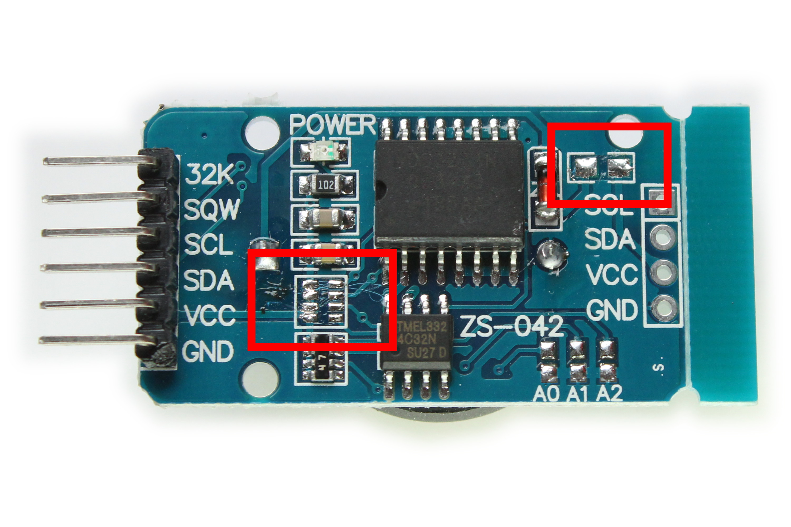
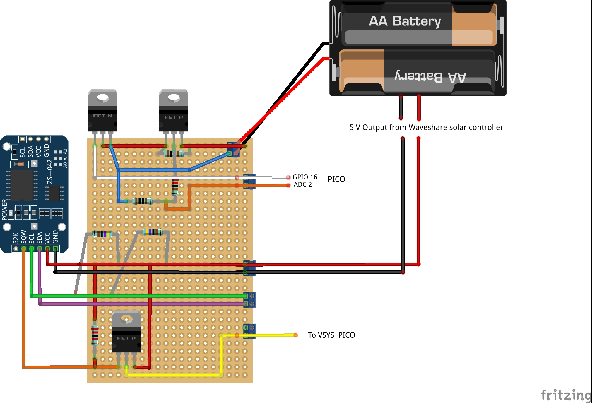

# Build Overview

----

This Pico-based Data Logger is a low-power, autonomous environmental monitoring system. It incorporates a Raspberry Pi Pico WH, multiple sensors, power management circuits, and data storage components to ensure efficient and reliable data collection. Below is a comprehensive breakdown of the hardware components, along with step-by-step assembly instructions.


## Hardware Components

1. Core Processing Unit

    Raspberry Pi Pico WH – Microcontroller handling data acquisition, processing, and storage.

2. Sensors

    Temperature Sensors:
        3 × DS18B20 (1-Wire protocol) for temperature measurements.
    Temperature & Humidity Sensors:
        3 × SHT30 (I2C protocol) for dual temperature and humidity readings.

3. Data Storage

    2 × SD Card Breakout Boards – Connected via SPI for redundant data logging.

4. Power Management

    Waveshare Solar Power Manager Module – Manages solar charging and battery output.
    14500 LiPo Battery – Provides backup power for continuous operation.
    DS3231 Real-Time Clock (RTC) – Controls power cycles to optimize energy consumption.

5. Transistors and Resistors

    MOSFETs:
        P-Channel: 2 × IRF4905
        N-Channel: 1 × IRFZ44N
    Resistors:
        2 × 4.7KΩ
        1 × 220KΩ
        1 × 1KΩ
        1 × 2.2KΩ
        1 × 100KΩ

6. Additional Components

    PCA9546A I2C Multiplexer – Used to expand the I2C bus for multiple sensors.
    Adafruit Proto Underplate – A prototyping board for mounting and connecting components.
    Jumper wires
    Perf-board (i used 6 x 4 cm)
    Water proof housing ( https://www.amazon.de/-/en/dp/B0D4V6SBXM?ref=ppx_yo2ov_dt_b_fed_asin_title )
    RJ45 patch cables (https://www.amazon.de/-/en/dp/B0797SCT55?ref=ppx_yo2ov_dt_b_fed_asin_title)
    RJ45 water proof couplings (https://www.amazon.de/-/en/dp/B0CRZ3MTG8?ref=ppx_yo2ov_dt_b_fed_asin_title)
 


  ## **Step-by-Step Assembly**  

### **1. Setting Up the Raspberry Pi Pico WH**  

The Raspberry Pi Pico WH comes pre-soldered with headers, making it easier to connect components. However, if you are using a standard **Raspberry Pi Pico** (without pre-soldered headers), you will need to solder them manually before proceeding.  


### **Soldering the Headers (If Necessary)**  
If you are using a **Raspberry Pi Pico (non-WH version)** without pre-soldered headers, follow these steps:  

#### **Required Materials:**  
- **40-pin male headers** (included with most Pico kits)  
- **Soldering iron** (set to ~350°C)  (or a a fixed temperatrure iron over 40W)
- **Solder**  
- **Breadboard** (optional but recommended)  

#### **Steps:**  
1. Insert the **male headers** into a breadboard to hold them steady.  
2. Place the **Pico board** onto the headers with the component side facing up.  
3. Heat one **corner pin** with the soldering iron and apply **a small amount of solder** to hold the header in place.  
4. Repeat for the opposite corner to keep the board level.  
5. Solder the remaining pins, ensuring a clean, shiny connection without excess solder.  
6. Inspect the joints and remove any solder bridges if necessary.  

### **Flashing MicroPython onto the Pico WH using Thonny**  

Before the Pico WH can run your data logging program, you must install **MicroPython**—a lightweight Python implementation designed for microcontrollers. Follow these steps to flash MicroPython onto your Pico WH using **Thonny IDE**:  

#### **Step 1: Download and Install Thonny**  
1. Visit [Thonny’s official website](https://thonny.org/) and download the version suitable for your operating system.  
2. Install Thonny by following the on-screen instructions.  

#### **Step 2: Connect the Pico WH in Bootloader Mode**  
1. **Hold down the BOOTSEL button** on the Pico WH.  
2. While holding the button, **connect the Pico WH to your computer** using a micro-USB cable.  
3. Release the **BOOTSEL button** once the device appears as a new storage drive named **RPI-RP2** on your computer.  

#### **Step 3: Download and Install MicroPython**  
1. Open **Thonny IDE**.  
2. Click on **"Run" → "Select Interpreter"** from the menu.  
3. In the dialog box, choose:  
   - **Interpreter**: MicroPython (Raspberry Pi Pico)  
   - **Port**: Select the COM port where the Pico is connected  
4. If MicroPython is not already installed, Thonny will prompt you to **install MicroPython firmware**.  
5. Click **"Install"** and wait for the process to complete.  

#### **Step 4: Verify MicroPython Installation**  
1. After installation, a **Python shell (REPL)** will appear at the bottom of Thonny.  
2. Type:  
   ```python
   print("Hello, Pico!")
   ```  
   and press **Enter**. If the message prints successfully, MicroPython is installed correctly.  

---

### **2. Modifications to the DS3231**

Articles I have read, including this [blog](https://thecavepearlproject.org/2014/05/21/using-a-cheap-3-ds3231-rtc-at24c32-eeprom-from-ebay/), highlight the need for modifications to the DS3231 to ensure proper functionality when using its alarm as a trigger for the P-channel MOSFET.  

The DS3231 includes pull-up resistors on the SQW (alarm) line, which must be removed. However, these resistors are part of a resistor block that also contains the necessary I2C lines (SCL, SDA). To compensate for their removal, external 4.7KΩ pull-up resistors must be reintroduced into the circuit to maintain proper operation. This modification provides greater control over the pull-up resistance for the SQW (alarm) line, ensuring reliable triggering.

The other necessary modification is the removal of the charging circuit for the coin battery. The same [blog](https://thecavepearlproject.org/2014/05/21/using-a-cheap-3-ds3231-rtc-at24c32-eeprom-from-ebay/) mentioned earlier, along with other sources, recommends disabling this feature for safety reasons.  

To achieve this, the charging resistor can be removed.  

The image below highlights both resistors that should be removed. Applying heat and gentle pressure will quickly dislodge them. However, be careful not to apply excessive force, as this could damage the DS3231 or cause injury.





### **3. Making the auto-power off and voltage indicator circuits**





  
