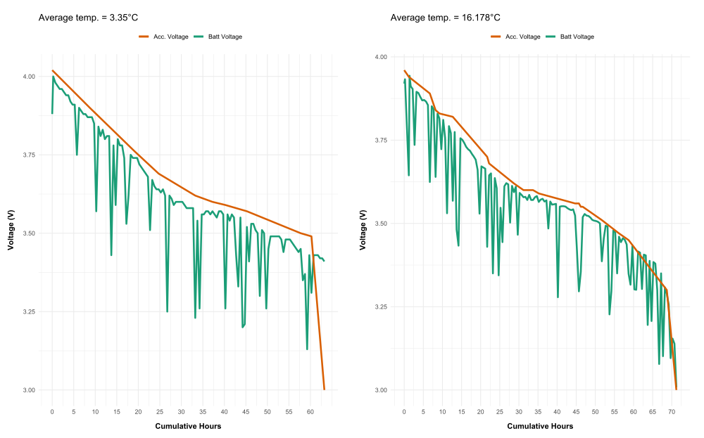
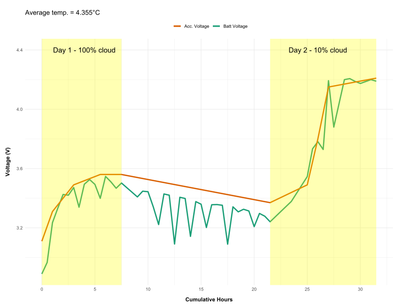

# Test 1: Battery Life

### Objective:
The goal of this test was to determine how long the data logger could operate on a fully charged battery under normal operating conditions, as well as to assess its overall power consumption profile.

### Method:

1. **Fully Charged the Battery**:
   - Verified that the battery was completely charged to 100% using the "LED charge status" indicator on the Waveshare power manager unit.
   - Measured the battery's voltage using a multimeter for an initial baseline.

2. **Ran the Data Logger Under Normal Load**:
   - Configured the data logger to record data at the standard sampling rate of 30-minute intervals.
   - Ensured that all sensors were running simultaneously to simulate real-world conditions:
     - 3 x DS18B20 temperature sensors
     - 3 x SHT30 humidity/temperature sensors
   - Used Wi-Fi to transmit data to the cloud during the test.

3. **Monitored Battery Status**:
   - Continuously monitored the battery level throughout the test using the system's battery tracking feature.
   - Logged the battery percentage at regular intervals and tracked its decrease over time.
   - Periodically validated the battery readings by using a multimeter to measure the system's voltage, ensuring accurate voltage measurements.

4. **Test Duration**:
   - Let the system run until the battery voltage reached 3.2V (the lowest safe voltage before potentially damaging the battery).
   - **Test Conditions**: Conducted tests in two different environments:
     - Indoor conditions with relatively stable temperature (~15°C)
     - Outdoor conditions under typical operating conditions in Germany (March 8th, 2025)

5. **Recorded Findings**:
   - **Documented Conditions**: Recorded temperature and humidity data from the sensors.
     - **Indoor or Outdoor**: Noted the treatment type (Indoor/Outdoor).
     - **Time**: Used datetime stamps of data logs to calculate battery runtime.
     - **Unit Voltage**: Recorded the voltage from the voltage divider on the unit.
     - **Actual Voltage**: Measured voltage periodically with a multimeter at the same time as it was being read by the unit.

6. **Post-Test Analysis**:
   - **Evaluated Performance**: Compared the battery life across both test conditions and noted any temperature variances.
   - **Identified Efficiency Improvements**: Analyzed components that may have consumed more power than anticipated (e.g., sensors, Wi-Fi module, or data storage).

### Results

### 1. **Overview of Test Setup**
   - **Data Logger Configuration**: The data logger was set to record data at 30-minute intervals, using 3 x DS18B20 temperature sensors and 3 x SHT30 humidity/temperature sensors. Data was transmitted to the cloud via Wi-Fi.
   - **Test Conditions**: Two testing environments were used:
     - **Indoor**: Stable temperature (~15°C)
     - **Outdoor**: Normal operating conditions in Germany (March 8th, 2025)
   - **Battery Monitoring**: Battery voltage read from the voltage divider was monitored , with periodic validation using a multimeter.

### 2. **Battery Runtime**

#### **Indoor Test Duration**
- **Start Voltage**: 3.92 V (actual: 3.96 V)  
- **End Voltage**: 3.00 V (actual: 3.00 V)  
- **Total Runtime**: 71.2 hours  

#### **Key Observations**
- The internal voltage reading is approximately **0.02 V lower** than the multimeter reading at its maximum value.  
- Significant noise is present, likely due to the **ADC on the Raspberry Pi Pico**, causing fluctuations of around **±0.2 V**.  
- While the general trend of the internal voltage reading is accurate, it **is not reliable** for low-power shutoff decisions.  
- The **Waveshare power manager** automatically cuts power at **3.0 V**.
   
---
   - **Outdoor Test Duration**:
     - **Start Voltage**: 4.0 V 
     - **End Voltage**: 3.0V
     - **Total Runtime**: 63.2 H
       
     - **Key Observations**
     - The  colder average temperatrure reduced run time by approx. 10 hours.
       

### 3. **Recharging Process**

   **Starting volatge**: 3.0V
   
**Day 1** - 100% cloud
**Recharging Time**: 0.4 V in 7.5 hours = 0.053 V / H

**Day 2** - 10% cloud
**Recharging Time**: 0.84 V in 9.5 hours = 0.088 V / H
   
   - **Comments**: Happy with recharge effectivness, particularly on day 1 with 100% cloud. 
     

### 7. **Conclusion**

The battery life tests provided valuable insight into the data logger's real-world power performance and highlighted both strengths and areas for optimization.

- **Runtime Observations**:
  - Indoors, the logger maintained full functionality for over **71 hours**, indicating strong performance under thermally stable conditions.
  - Outdoors, runtime dropped to **63.2 hours**, confirming that **colder ambient temperatures reduce battery efficiency** by approximately **10 hours**, consistent with expectations for Li-ion cells.

- **Voltage Monitoring**:
  - The internal ADC-based voltage readings from the Pico were generally useful for trend analysis but **not sufficiently accurate** for determining low-voltage cutoffs due to **±0.2 V fluctuation**.
  - External multimeter readings confirmed that the **Waveshare power manager reliably cut off at 3.0 V**, protecting the battery from over-discharge.

- **Recharging Insights**:
  - The system recharged effectively even under **100% cloud cover**, gaining **0.4 V over 7.5 hours**.
  - On a mostly clear day (10% cloud), recharge rate improved to **0.088 V/hour**, reaffirming the **suitability of the solar panel and power management system** for off-grid use.

- **General Performance**:
  - The combination of **low-frequency sampling (30 min intervals)** and **hardware-level power control** allowed the unit to perform as intended, with **multi-day operation** feasible between charges.
  - These results confirm the logger is **well-suited for short-term deployments (2.5–3 days)** on battery alone, and **indefinite operation** is possible with moderate solar exposure.

Overall, the test confirms the data logger is capable of sustained autonomous operation under real-world conditions and is suitable for deployment in field-based microclimate studies.

  

